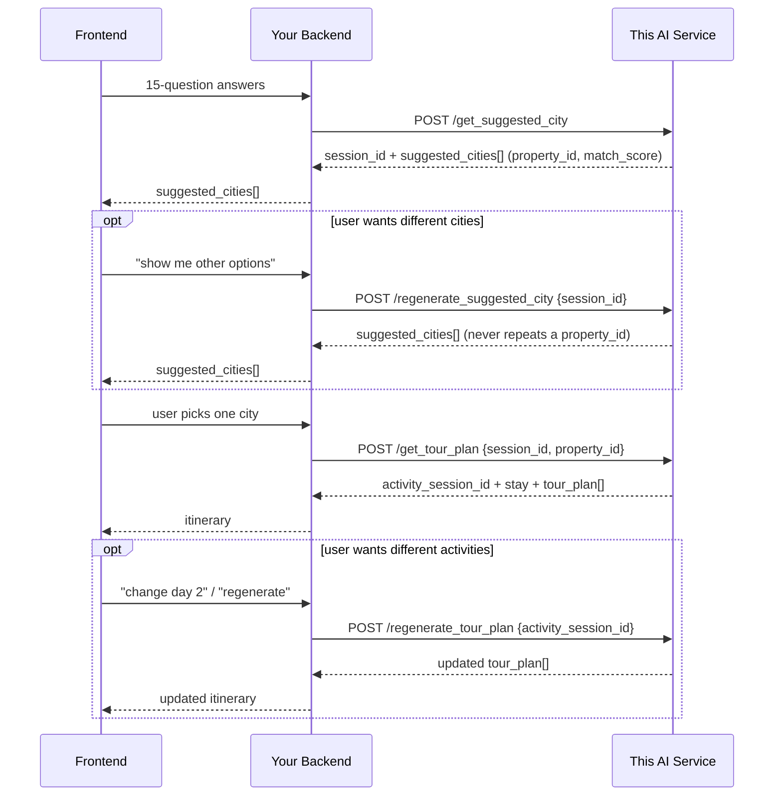

# Backend Integration Guide — Two-Step Trip Flow

This is the end-to-end guide for whoever wires the frontend to this service
through your backend (Frontend → your Backend → this AI service → your
Backend → Frontend). It ties together the two steps of the flow and the
session lifecycle between them. For the detailed field-by-field contract of
each step, see `API_CITY_FLOW_DOCS.md` (Step 1) and `API_V2_DOCS.md` (the raw
property-matching engine both steps share).

## 1. The flow, in one picture



## 2. Step 1 — get city suggestions

```
POST /get_suggested_city
```

Send the 15-question answers exactly as documented in `API_CITY_FLOW_DOCS.md`
§2. You get back a `session_id` and a list of cities, each backed by one real,
ranked property (`property_id`, `match_score`). Store `session_id` — every
later call in this flow (regenerate, activities) is keyed off it.

If the user wants different options before picking, call
`POST /regenerate_suggested_city` with the same `session_id`; it deterministically
returns the next-best distinct cities and never repeats a property already
shown in that session. See `API_CITY_FLOW_DOCS.md` §4 for the full contract
and its one new error case (`409` for sessions created before this change).

## 3. Step 2 — get the activity list for a chosen city

```
POST /get_tour_plan
```

This endpoint itself has **not** changed in shape or behavior — it still
returns `activity_session_id`, `stay` (the hotel/resort), `tour_plan`
(day-by-day activities with real addresses/photos/distances once available),
`total_cost_estimate`, `packing_tips`, `travel_tips`, exactly as before.

What's new is **what you send it**. Once Step 1 returns `property_id` for the
city the user picked, pass it through:

```json
{
  "session_id": "435730a0-1831-46dd-bf14-515570e20114",
  "selected_city": "Nusa Dua Bali",
  "property_id": "retreat_118"
}
```

`selected_city` is still required in the request body (kept for backward
compatibility), but when `property_id` is present it takes priority: the
itinerary is built around that *exact* matched property, not a fuzzy
city-name search that could land on a different, same-named place. Always
send the `property_id` you got back from Step 1 — don't leave it out just
because `selected_city` is also required.

Sample response (abridged to one day):

```json
{
  "activity_session_id": "df247981-e317-4696-8f22-5a15e486e687",
  "city": "Nusa Dua Bali",
  "stay": {
    "name": "Revivo Wellness Resort",
    "address": "Nusa Dua Bali, Indonesia (approximately)",
    "rating": 3.5,
    "price_level": "Premium (approximately)",
    "photos": [],
    "coords": null,
    "average_nightly_price": "$200+",
    "budget_tier": "Premium",
    "facilities": ["Diagnostics: Medical", "Spa: 7", "Nutrition: 8", "Mindfulness: 7", "Fitness: 7"],
    "website": "revivoresorts.com",
    "estimate_note": "Unavailable address, rating, price level values are (approximately)."
  },
  "tour_plan": [
    {
      "day": 1,
      "activities": [
        {
          "activity_name": "Sunrise Meditation",
          "activity_description": "Guided breathwork and meditation session",
          "activity_location": "Beachfront pavilion",
          "activity_address": "N/A",
          "activity_image": [],
          "activity_time": "06:30 AM - 07:30 AM",
          "activity_cost": 0,
          "distance_from_previous_km": null
        },
        {
          "activity_name": "Breakfast at Ocean View Cafe",
          "activity_description": "A convenient breakfast stop near the day's planned route.",
          "activity_location": "Ocean View Cafe",
          "activity_address": "2 Beach Rd",
          "activity_image": [],
          "activity_time": "08:00 AM - 09:00 AM",
          "activity_cost": 18,
          "distance_from_previous_km": null
        }
      ]
    }
  ],
  "total_cost_estimate": 1223.0,
  "packing_tips": "Pack light, breathable layers.",
  "travel_tips": "Airport transfer is easiest booked in advance.",
  "source": "generated"
}
```

`"estimate_note"` fields marked `(approximately)` mean the live hotel-lookup
tool didn't have that exact value and the system filled it in from the
property's own database record — same "never silently claim precision you
don't have" behavior the old flow already had for hotels.

If you call `/get_tour_plan` again with the same `session_id` + destination,
you get back the cached activity session (`"source": "cached"`) instead of
regenerating — also unchanged behavior.

To regenerate part or all of the activities, use
`POST /regenerate_tour_plan { "activity_session_id": ..., "day_to_regenerate": <int|null>, "user_instruction": "..." }`
exactly as before — nothing changed here.

## 4. Session storage — what you need to know, what you don't

You don't need to manage any new state on your backend. `session_id` and
`activity_session_id` remain the only two handles you pass around; this
service keeps everything else (the questionnaire, the ranked/shown properties,
the itinerary, regeneration history) in its own session store, exactly like
before.

**One caveat carried over from the old flow, now worth calling out
explicitly:** these sessions live in this service's process memory. They are
not durable across a restart and won't stay consistent if this service ever
runs as more than one worker process. If your integration needs sessions to
survive a redeploy or to work behind a multi-worker/multi-instance setup,
that's tracked as required follow-up work on this side
(`BACKEND_DEVELOPER_CHANGES.md` "Persistence and Versioning") — flag it if
your rollout plan depends on it sooner.

## 5. Error handling

| Status | When | What to do |
|---|---|---|
| `422` | Request body doesn't match the schema (unknown enum, missing field, more than 3 `transform_focus`, etc.) | Surface the field-level `detail` array to help debugging; don't retry with the same body. |
| `404` (`/get_tour_plan`, `/regenerate_tour_plan`, `GET /session/...`) | `session_id`/`activity_session_id`/`property_id` not found | Start a new Step 1 call; a `property_id` from an old deploy's catalog snapshot won't resolve after data changes. |
| `409` (`/regenerate_suggested_city`) | Session predates this integration (no stored profile) | Start a new session via `/get_suggested_city`. |
| `500` | Upstream tool/LLM failure that wasn't otherwise recoverable | Safe to retry; the matching/ranking itself is deterministic and side-effect-free. |

## 6. Quick reference

| Endpoint | Changed? | Purpose |
|---|---|---|
| `POST /get_suggested_city` | **Yes — request body and response fields** | Step 1: 15-question profile → ranked real cities |
| `POST /regenerate_suggested_city` | **Yes — behavior (deterministic, no repeats)** | Step 1 regenerate |
| `POST /get_tour_plan` | Additive only (`property_id` field) | Step 2: city/property → day-by-day activities |
| `POST /regenerate_tour_plan` | No | Step 2 regenerate |
| `GET /session/{id}`, `GET /activity_session/{id}` | No | Fetch stored session details |
| `DELETE /session/{id}`, `DELETE /activity_session/{id}` | No | Delete a session |
| `POST /v2/retreat-recommendations` | New (added earlier) | Raw ranked property list, not grouped into cities — used internally by Step 1, also directly callable |
